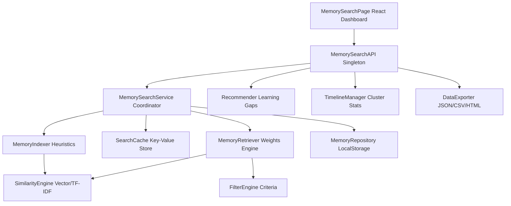

# Universal Memory Search Engine (Semantic Memory Explorer)

The Universal Memory Search Engine is a local-first, high-fidelity subsystem of the Nexus Protocol. It processes, indexes, stores, and searches decentralized AI interaction memories, sovereign twin preferences, and cryptographic negotiation logs.

---

## Architecture Overview



---

## Core Subsystems

### 1. Semantic Similarity Engine (`/semantic-search/SimilarityEngine.ts`)
- **Real Embeddings**: Uses the Google Gemini API `text-embedding-004` model when `process.env.GEMINI_API_KEY` is loaded.
- **Local Fallback**: Employs a term-frequency inverse-document-frequency (TF-IDF) cosine vector similarity algorithm on sentence structures.
- **Query Expansion**: Combines queries with a technical synonym mapping directory to achieve semantic association matching even when query terms are not exact matches (e.g. associating "security" with "ZKPs" and "threats").

### 2. Memory Indexer (`/indexing/MemoryIndexer.ts`)
- **Metadata Enforcer**: Evaluates string sizes, tags, timestamps, and classifications.
- **Heuristic Categorization**: Classifies memories automatically to `conversation`, `knowledge`, `interaction`, or `system` categories if omitted.
- **Heuristic Importance Boosts**: Automatically boosts memory significance ratings to `0.9+` if terms matching threats or authorization logs are parsed.

### 3. Logical Filters & Collections (`/filters/FilterEngine.ts` and `/collections/CollectionManager.ts`)
- **Boolean Multi-filters**: Matches date-ranges, category lists, source modules, tags, agent constraints, and favorite flags.
- **Smart Folders**: Evaluates collections whose membership is computed dynamically via an underlying SearchQuery query instead of a static array.

### 4. Weights Retriever (`/retrieval/MemoryRetriever.ts`)
- Computes ranked memory matches by blending Relevance score (similarity match), Recency score (timestamp decay), and Importance score:
  
  $$\text{Score} = (W_{\text{Relevance}} \times S_{\text{Relevance}}) + (W_{\text{Importance}} \times S_{\text{Importance}}) + (W_{\text{Recency}} \times S_{\text{Recency}})$$

- Weights shift dynamically depending on user sorting selections (Relevance, Recency, Importance).

---

## Integration Guide

### API Instance Injection

```typescript
import { mockMemorySearchAPI } from '@/core/memory-search/api/MemorySearchAPI';

// Ingestion
const freshMemory = await mockMemorySearchAPI.ingest({
  content: 'Assimilated new Vercel Composition Patterns for React.',
  category: 'knowledge',
  source: 'Cognitive Graph',
  importance: 0.7,
  tags: ['react', 'clean-code']
});

// Query
const response = await mockMemorySearchAPI.query({
  text: 'react components',
  searchType: 'hybrid',
  minImportance: 0.5,
  sortBy: 'relevance'
});

console.log(`Time taken: ${response.timeTakenMs}ms`);
console.log(`Matches:`, response.results);
```

---

## Verifications & Testing

Unit, integration, and semantic scoring assertions are bundled inside `/core/memory-search/__tests__/memory-search.test.ts`. 

To execute verification tests:
1. Navigate to **Memory Explorer** (`/memory-search`) on the local UI dashboard.
2. Click **Run Test assertions** under the **Core Engine Tests** side-panel.
3. Review results in the output list.
